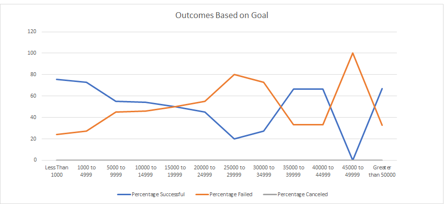

# An Analysis of Kickstarter Campaigns

## Overview
We are performing analysis on Kickstarter data to uncover trends in data. The Kickstarter data was procured from Kickstarter.com between the years 2010 and 2017 and covers a variety of categories such as games, music, and plays. We've done feature engineering to create new features from existing features such as Percentage Funded, Subcategory, and date Created Conversion to better analyze the present information. Some challenges that were encountered include formulas like COUNTIFS and the speficity of the placement of information within it's parameters. With continued experimentation, a resolution was only a short period of time away.

## Outcomes Based on Goals for plays
The project goal that would be most ideal and have the highest percentage success rate would be the goal of less than one-thousand. It has close to a seventy six percent success rate making it the best choice for a new kickstarter. One could easily make a reasonably small play project with small demands to learn how to kickstart and have a high likelihood of reaching the project goal.

## Outcomes by Launch Date for theater
Projects would seem most successful in the spring time and especially around may. Projects have their highest rate of failure in december as the number of successful projects mirrors the number of failed projects. One would likely want to have their kickstarter projects span over late spring and early summer, when life is most alive and people are at their happiest. One would also want to avoid late fall and early winter as this is the time seasonal depression starts to sit on peoples minds. 

## Summary and Limitations
This dataset is a little more than four thousand records long and might not properly fully represent the entirety of Kickstarter data. There were no canceled plays in this dataset. Does this mean that kickstarter projects for plays never get canceled? One would deduce that it is unlikely. The greatest limitation to the dataset is the record size given.
